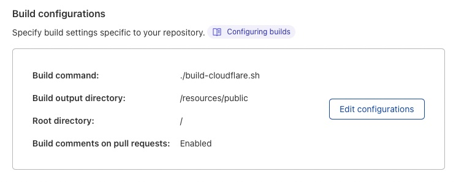

# Staticly

> "All science is static in the sense that it describes the unchanging aspects of things." [Franck Knight](https://en.wikipedia.org/wiki/Frank_Knight).

An opinionated Static-Site Generator associating [Clojure](https://clojure.org), [Hiccup](https://github.com/weavejester/hiccup), [Markdown](https://www.markdownguide.org) and [TailwindCSS](https://tailwindcss.com) with the following stated goals:

* Use **configuration by convention** whenever it's possible
* Use Clojure's **Hiccup format** and pure clojure function for composition and templating
* Use Markdown and provides utility to **process markdown effectively** (a la Markdoc)
* **Good developer experience** (at least on MacOS for the moment): Reload the browser's tab(s) displaying the rendered HTML file(s) whenever a change is made to either clojure code or markdown files (so no dev Server logic in order to keep the code simple) using AppleScript interacting with Safari.
* **Tailwind CSS friendly**, as it's a very efficient way of doing styling.
* **Target static page hosting** with a CI/CD mechanism like [Cloudflare Pages](https://pages.cloudflare.com) that will build and host your HTML files (example in section [Cloudflare Hosting](#cloudflare-hosting))

<!-- markdown-toc start - Don't edit this section. Run M-x markdown-toc-refresh-toc -->
**Table of Contents**

- [Staticly](#staticly)
- [Rationale](#rationale)
- [Usage](#usage)
    - [Rendering with everything in a Clojure `render` function](#rendering-with-everything-in-a-clojure-render-function)
    - [Page rendering from Markdown files with a template](#page-rendering-from-markdown-files-with-a-template)
        - [Basic Usage](#basic-usage)
        - [Advanced usage: functions outputting specific HTML for some markdown elements](#advanced-usage-functions-outputting-specific-html-for-some-markdown-elements)
        - [Conventions](#conventions)
        - [Example](#example)
    - [Blog rendering with Markdown files](#blog-rendering-with-markdown-files)
- [Hosting](#hosting)
    - [Cloudflare hosting](#cloudflare-hosting)
- [Metadata and front-matter](#metadata-and-front-matter)
    - [YAML front-matter](#yaml-front-matter)
    - [EDN front-matter](#edn-front-matter)

<!-- markdown-toc end -->

# Rationale

I wanted a versatile blog engine in Clojure that allows me build website and blog in an easy and simple way with the following features:
* Hiccup component based as I found it's a very easy way to build reusable components, utility to convert [Tailwind CSS](https://tailwindcss.com) and [UI](https://tailwindui.com/components) components into hiccup
* Markdown processing with a way to override how each element are rendered (thanks to [nextjournal/markdown](https://github.com/nextjournal/markdown))

# Usage

## Rendering with everything in a Clojure `render` function

You write a `render` function in your ns, with no argument, that just output a Hiccup data structure, you're free to use any data structure and way of structuring (or not) the content. Then you add the `def-render-builder` macro invocation at the end of the namespace that will:

* **Export the HTML**, from the hiccup returned by the `render` function, in the `resources/public` directory with the namespace last name as the filename with the `.html` suffix,
* **Reload the browser's tab(s)** that have the namespace first name in the url,
  * E.g. the `mywebsite.index` namespace will export the rendered HTML in the `resources/public/index.html` file and reload the tab with `mywebsite` in its URL,
* **Define a `build!` function** in that namespace that will do the export and reload steps describe above.


```clojure

(ns mywebsite.index)

(require 'defsquare.staticly)

;;YOU write
(defn head []
 ...)

(defn body []
 ...)

(defn footer []
 ...)

(defn render []
  [:html {:lang "en"}
    (head)
    (body)
    (footer)])

;;WE export the html, reload the browser and define a `build!` function in that ns
(staticly/def-render-builder)

```

## Page rendering from Markdown files with a template

### Basic Usage 
The idea is to have a markdown file (with a front-matter in Yaml or EDN) associated with the template defined in a Clojure function.
You write a `page-template` function in your ns with one argument that outputs hiccup:

* The only argument is a map with the keys representing the markdown: `{:keys [metadata html hiccup raw] :as markdown}` the markdown is pre-processed with hiccup, standard html and metadata from the front matter. 

The template is a 1-arg `page-template` function with map as an argument representing the markdown: metadata, html, hiccup and raw content, this function should output hiccup.

Staticly provices a macro `def-page-builder` you should put at the end of your namespace that will:

- define a `build!` function in the ns to invoke whenever a change is made
- Start a watcher thread detecting change in markdown files and invoking the `build!` function then reload the browser tabs

### Advanced usage: functions outputting specific HTML for some markdown elements

We rely on the great [nextjournal/markdown library](https://github.com/nextjournal/markdown) to be able to customize the emitted HTML from the markdown (see the `page-transform` function in the example below). Staticly offers shortcut functions for transforming markdown to hiccup (`->hiccup`, `normalize` and `into-markup`). Here is the [list of the available keys to bind your markdown->hiccup renderer with](https://github.com/nextjournal/markdown/blob/main/src/nextjournal/markdown/transform.cljc#L66).

### Conventions

* The markdown files must sit in the directory with the same name as your ns last name: `website.pages` means the markdowns are in the `pages` directory at the root of your repo 
* The exported HTML files are named from the markdown file name: `my-specific-content.md` means the HTML is named as `my-specific-content.html`

### Example

``` clojure
(ns mywebsite.pages
  (:require [defsquare.markdown :as md]
            [defsquare.staticly :as staticly]
            [mywebsite.common :refer [footer page-header menu-entries]]))

(defn page-transform [metadata raw]
  (let [metadata (md/parse-metadata-str raw)
        data (-> raw md/drop-metadata-str md/parse)]
    (md/->hiccup {:heading (fn [_ctx node]
                                 (case (:heading-level node)
                                   1 [:h1 {:class "font-title ml-2 mb-8 underline decoration-solid decoration-accent underline-offset-8"
                                           :id    (md/normalize (get-in node [:content 0 :text]))}
                                      (get-in node [:content 0 :text])]
                                   2 [:h2 {:class "font-title text-xl ml-2 mb-8decoration-solid decoration-accent underline-offset-8"
                                           :id    (md/normalize (get-in node [:content 0 :text]))}
                                      (get-in node [:content 0 :text])]
                                   [(keyword (str "h" (:heading-level node))) {} (get-in node [:content 0 :text])]))
                  :bullet-list (partial md/into-markup [:ul])
                  :list-item   (partial md/into-markup [:li {:class "font-body text-gray-700" :style "list-style-type: square"}])
                  :paragraph   (partial md/into-markup [:section {:class "font-body sm:ml-1 ml-2 mt-8 text-gray-700"}])
                  :plain       (partial md/into-markup [:p {:class "font-body text-gray-700"}])}
      data)))

(defn page-template [{:keys [metadata html hiccup raw] :as markdown}]
  [:html {:lang "en"}
   (head (:head metadata))
   [:body {:class "antialiased"}
    (page-header "img/logo/logo-mywebsite.svg"
                 (menu-entries ["Services" "Products" "Blog" "Company"] "Services")
                 [:div
                  [:span {:class "text-accent"} (:baseline1 metadata)]
                  [:span {:class "text-gray-100"}
                   (str " " (:baseline2 metadata))]
                  [:br {:class "xl:hidden"}]
                  ])
    [:div {:class "page container mx-auto"}
      [:div {:class "flex flex-wrap mb-16"}
       [:div {:class "w-full bg-white leading-normal relative max-w-3xl mx-auto flex-none"}
        (page-transform metadata raw)
        ]]]
   (footer)])

(staticly/def-page-builder)

```

## Blog rendering with Markdown files

Two "template" functions to implement :

* `post-template`: template that outputs HTML for a single markdown file
* `home-template`: template that outputs HTML given all the markdowns
* `tag-template`: template that outputs HTML for a given tag (holding a set of markdown files)

Staticly provides a macro `def-blog-builder` that:


# Engine implementation

The engine can be considered as a pipeline from a seq of `from` dirs that export `to` a single dir. 
The `from` dirs contains either assets (js, css, img files) that are _copied_ or markdown files that are _rendered_.
The engine has currently 2 options of input/output for templates:

| Input | Output | Key in templates param | Usage |
|---|---|---|---|
|  one file        | one output file         | `:1-1` | one markdown file gives one HTML file (About page, a landing page) |
|  multiple files  | one output file         | `:n-1` | multiple markdown files gives one HTML file (the home of a blog that lists all the posts, the posts for an author) |


|  one file        | multiple output files   | `:1-n` |
|  multiple files  | multiple output files   | `:n-n` | 

## Assets copy

Assets (file types in `(def copied-filetypes #{"jpg" "png" "svg" "css" "html" "js"}`) are copied with the relative path from the root `from` dir to the `to` destination dir.

## Templating

Templates takes an input files in the file types `(def rendered-filetypes #{"md" "clj" "cljc" "cljs" "yaml" "json" "edn"})` and return hiccup in a map with keys a string as the path to the file they will be rendered into.
For every input files, each one are given as a map to the template with the following keys:

* `path` a path object of the file
* `file`, file object
* `raw` a string with the raw content of the file
* `type` a string among the rendered-filetypes `md`, `clj`, `cljc`, `cljs`, `yaml`, `json` or `edn`

plus the following keys for:

* `md` files: `:hiccup` (for the html or custom transformation see section ) and `:metadata` with the EDN content of the YAML front-matter
* `yaml`, `json` or `edn`: conversion and evaluation under the `:data` keys
* `clj`, `cljc` or `cljs`: evaluation of the file (so the file's symbols are then available in its namespace)

A template then return a map of string for path as key and hiccup as value.

The `build!` function is configured with a map with the `from`, `to` and `templates`.


# Hosting

## Cloudflare hosting

Define a project on [Clouflare Pages](https://developers.cloudflare.com/pages/get-started/)
 
Write a `build` namespace that will invoke all the included namespace building your content.
E.g.:

```clojure
(ns mywebsite.build)

(defn -main [& args]
  (index/build!)
  (blog/build!)
  (pages/build!)
  (shutdown-agents))
```
Write a shell script invoking the previous build ns that will be invoked by the Cloudflare's CI (note we just install Clojure on the default Cloudflare image):

``` shell
#!/bin/bash

curl -O https://download.clojure.org/install/linux-install-1.11.1.1165.sh
chmod +x linux-install-1.11.1.1165.sh
sudo ./linux-install-1.11.1.1165.sh

clojure -m mywebsite.build

if [ $? -eq 0 ]; then
    echo "My website successfully built!"
else
    echo "Failure during website build, check what's gone wrong!"
    exit $?
fi

# don't forget to build the CSS
npx tailwindcss -i ./src/mywebsite/styles.css -o ./resources/public/css/mywebsite.css

```

# Developer Experience with Tailwind CSS and Hiccup

[Tailwind UI](https://tailwindui.com/components) (and [Taildwind Templates](https://tailwindui.com/templates) or various ones - like [Cruip](https://cruip.com) - you can find on the web) provides components with their HTML code you can copy easily in your clipboard.
To get the Hiccup corresponding to the HTML code you just have to execute the following Clojure code:

``` clojure
(require '[defsquare.hiccup :refer :all])
;;copy the HTML code in your system clipboard

(html->hiccup (paste)) ;;=>  [:div {:class "flex min-h-full flex-col justify-center py-12 sm:px-6 lg:px-8"} [:div ... ]]]

;or you can just convert your clipboard by doing this
(-> (paste)
    html->hiccup
    str
    copy)

;;here is the fully qualified version to avoid any require
(->
  (defsquare.clipboard/paste);;paste the system clipboard into a string
  (defsquare.hiccup/html->hiccup);;transform that string into Hiccup data structure 
  (clojure.pprint/pprint);;align and wrap the result
  (with-out-str);;into a string
  (defsquare.clipboard/copy);;copy back the string with hiccup into the system clipboard
  )

```

# Metadata and front-matter

## YAML front-matter

TODO

## EDN front-matter

TODO
